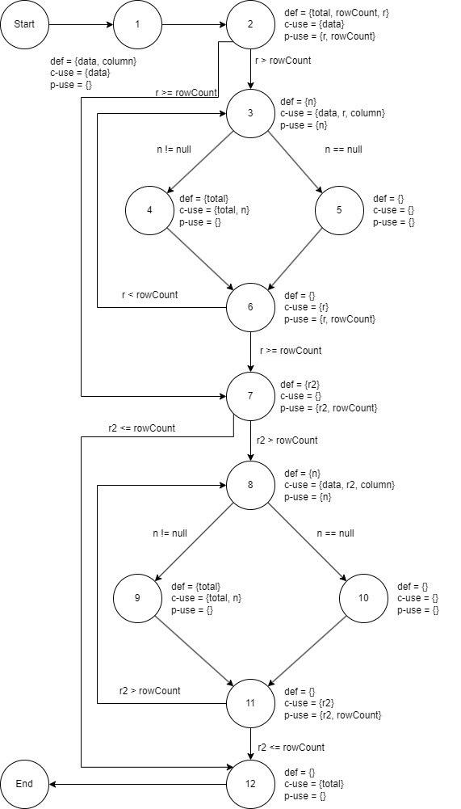
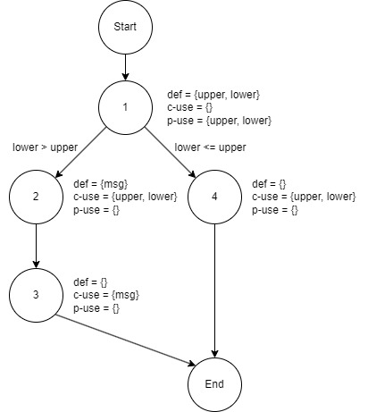

**SENG 438 - Software Testing, Reliability, and Quality**

**Lab. Report #3 – Code Coverage, Adequacy Criteria and Test Case Correlation**

| Group: Group Number   28  |
|-----------------|
| Student 1 name:   Ahmad Janjua        |   
| Student 2 name:   Maxwell Kepler      |   
| Student 3 name:   Christopher Luk     |   
| Student 4 name:   Matthew Ho          | 

(Note that some labs require individual reports while others require one report
for each group. Please see each lab document for details.)

**Table of Contents**

[1 Introduction	](#introduction)

[2 Detailed description of unit test strategy	](#detailed-description-of-unit-test-strategy)

[3 Test cases developed	](#test-cases-developed)

[4 How the team work/effort was divided and managed](#how-the-team-workeffort-was-divided-and-managed)

[5 Difficulties encountered, challenges overcome, and lessons
learned	](#difficulties-encountered-challenges-overcome-and-lessons-learned)

[6 Comments/feedback on the lab itself	](#commentsfeedback-on-the-lab-itself)

# 1 Introduction

In this lab, we were tasked with creating and implementing unit tests designed using white-box testing. In doing so, we learned about measuring the adequacy of our previous test suite from Lab 2 by measuring different coverage metrics. To accomplish this, we began by familiarizing ourselves with different testing tools, while trying to analyze our previous test suites on the statement, branch, and condition coverage. After this, we measured out data flow coverage manually by selecting two methods from org.jfree.data, and calculated their DU-pair coverage by tracing through their execution. We proceeded to design new unit tests to test DataUtilities and Range classes, with a goal of achieving a minimum of 90% statement coverage, 70% branch coverage, and 60% condition coverage. During this phase of the lab, we created a test plan and kept each test case in a separate method.

# 2 Manual data-flow coverage calculations for X and Y methods

## Data flow graph
### calculateColumnTotal

### getLength

## DEF-USE sets per statement
### calculateColumnTotal

DEF(1) = {data, column}, q(1) = {data} 
DEF(2) = {total, rowCount, r}, USE(2) = {data, r, rowCount} 
DEF(3) = {n}, USE(3) = {data, r, column, n} 
DEF(4) = {total}, USE(4) = {total, n} 
DEF(5) = Ø, USE(5) = Ø 
DEF(6) = Ø, USE(6) = {r, rowCount} 
DEF(7) = {r2}, USE(7) = {r2, rowCount} 
DEF(8) = {n}, USE(8) = {data, r2, column, n} 
DEF(9) = {total}, USE(9) = {total, n} 
DEF(10) = Ø, USE(10) = Ø 
DEF(11) = Ø, USE(11) = {r2, rowCount} 
DEF(12) = Ø, USE(12) = {total}

### getLength

DEF(1) = {upper, lower}, USE(1) = {upper, lower} 
DEF(2) = {msg}, USE(2) = {upper, lower} 
DEF(3) = Ø, USE(3) = {msg} 
DEF(4) = Ø, USE(4) = {upper, lower}

## All DU-pairs per variable
### calculateColumnTotal

du(1, 1, data) = {[1]} 
du(1, 2, data) = {[1,2]} 
du(1, 3, data) = {[1,2,3]} 
du(1, 8, data) = {[1,2,3,4,6,7,8], [1,2,3,5,6,7,8], [1,2,7,8]} 
du(1, 3, column) = {[1,2,3]} 
du(1, 8, column) = {[1,2,3,4,6,7,8], [1,2,3,5,6,7,8], [1,2,7,8]} 
du(2, 4, total) = {[2,3,4]} 
du(2, 9, total) = {[2,3,4,6,7,8,9], [2,3,5,6,7,8,9], [2,7,8,9]} 
du(2, 12, total) = {[2,3,4,6,7,8,9,11,12], [2,3,5,6,7,8,9,11,12], [2,3,4,6,7,8,10,11,12], [2,3,5,6,7,8,10,11,12], [2,7,8,9,11,12], [2,7,8,10,11,12]} 
du(4, 4, total) = {[4]} 
du(4, 9, total) = {[4,6,7,8,9]} 
du(4, 12, total) = {[4,6,7,8,9,11,12], [4,6,7,8,10,11,12]} 
du(9, 9, total) = {[9]} 
du(9, 12, total) = {[9,11,12]} 
du(2, 2, rowCount) = {[2]} 
du(2, 6, rowCount) = {[2,3,4,6], [2,3,5,6]} 
du(2, 7, rowCount) = {[2,3,4,6,7], [2,3,5,6,7]} 
du(2, 11, rowCount) = {[2,3,4,6,7,8,9,11], [2,3,5,6,7,8,9,11], [2,3,4,6,7,8,10,11], [2,3,5,6,7,8,10,11], [2,7,8,9,11], [2,7,8,10,11]} 
du(2, 2, r) = {[2]} 
du(2, 3, r) = {[2,3]} 
du(2, 6, r) = {[2,3,4,6], [2,3,5,6]} 
du(7, 7, r2) = {[7]} 
du(7, 8, r2) = {[2,8]} 
du(7, 11, r2) = {[7,8,9,11], [7,8,10,11]} 
du(3, 3, n) = {[3]} 
du(3, 4, n) = {[3,4]} 
du(8, 8, n) = {[8]} 
du(8, 9, n) = {[8,9]}

### getLength

du(1, 1, lower) = {[1]} 
du(1, 2, lower) = {[1,2]} 
du(1, 4, lower) = {[1,4]} 
du(1, 1, upper) = {[1]} 
du(1, 2, upper) = {[1,2]} 
du(1, 4, upper) = {[1,4]} 
du(2, 3, msg) = {[2,3]}

## For each test case, show which pairs are covered
### calculateColumnTotal

calculateColumnTotalForTwoValues: du(1, 1, data), du(1, 2, data), du(1, 3, data), du(1, 8, data), du(1, 3, column), du(1, 8, column), du(2, 4, total), du(2, 9, total), du(2, 12, total), du(4, 4, total) du(4, 9, total), du(4, 12, total), du(9, 9, total), du(9, 12, total), du(2, 2, rowCount), du(2, 6, rowCount), du(2, 7, rowCount), du(2, 11, rowCount), du(2, 2, r)du(2, 3, r), du(2, 6, r), du(7, 7, r2), du(7, 8, r2), du(7, 11, r2), du(3, 3, n), du(3, 4, n), du(8, 8, n), du(8, 9, n). 
calculateColumnTotalForNullValues: du(1, 1, data), du(1, 2, data), du(1, 3, data), du(1, 8, data), du(1, 3, column), du(1, 8, column), du(2, 4, total), du(2, 9, total), du(2, 12, total), du(4, 4, total) du(4, 9, total), du(4, 12, total), du(9, 9, total), du(9, 12, total), du(2, 2, rowCount), du(2, 6, rowCount), du(2, 7, rowCount), du(2, 11, rowCount), du(2, 2, r)du(2, 3, r), du(2, 6, r), du(7, 7, r2), du(7, 8, r2), du(7, 11, r2), du(3, 3, n), du(3, 4, n), du(8, 8, n), du(8, 9, n). 
calculateColumnTotalForInvalidIndex: du(1, 1, data), du(1, 2, data), du(1, 3, column), du(2, 2, rowCount), du(2, 2, r) 
calculateColumnTotalForNull: Ø

### getLength

lengthWithTwoDiffNeg: du(1,1,lower), du(1,4,lower), du(1,1,upper), du(1,4,upper) 
lengthWithTwoSameNeg: du(1,1,lower), du(1,4,lower), du(1,1,upper), du(1,4,upper) 
lengthWithZeroAndNeg: du(1,1,lower), du(1,4,lower), du(1,1,upper), du(1,4,upper) 
lengthWithTwoZeros: du(1,1,lower), du(1,4,lower), du(1,1,upper), du(1,4,upper) 
lengthWithZeroAndPos: du(1,1,lower), du(1,4,lower), du(1,1,upper), du(1,4,upper) 
lengthWithTwoSamePos: du(1,1,lower), du(1,4,lower), du(1,1,upper), du(1,4,upper) 
lengthWithTwoDiffPos: du(1,1,lower), du(1,4,lower), du(1,1,upper), du(1,4,upper) 
lengthWithNegAndPos: du(1,1,lower), du(1,4,lower), du(1,1,upper), du(1,4,upper)

## Calculate the DU-Pair coverage
### calculateColumnTotal
calculateColumnTotal:coverage = (29/29)*100%=100%

### getLength
getLength: coverage = 6/7*100%=85.714%

# 3 A detailed description of the testing strategy for the new unit test

Text…

# 4 A high level description of five selected test cases you have designed using coverage information, and how they have increased code coverage

Text…

# 5 A detailed report of the coverage achieved of each class and method (a screen shot from the code cover results in green and red color would suffice)

Text…

# 6 Pros and Cons of coverage tools used and Metrics you report

Text…

# 7 A comparison on the advantages and disadvantages of requirements-based test generation and coverage-based test generation.

Text…

# 8 A discussion on how the team work/effort was divided and managed

Text…

# 9 Any difficulties encountered, challenges overcome, and lessons learned from performing the lab

Text…

# 10 Comments/feedback on the lab itself

Text…
