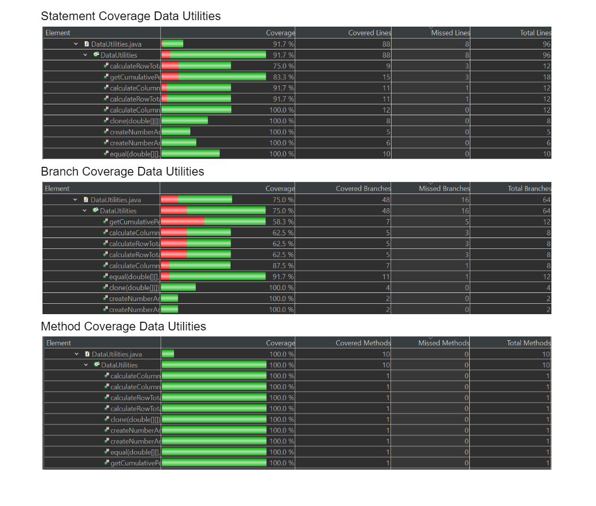
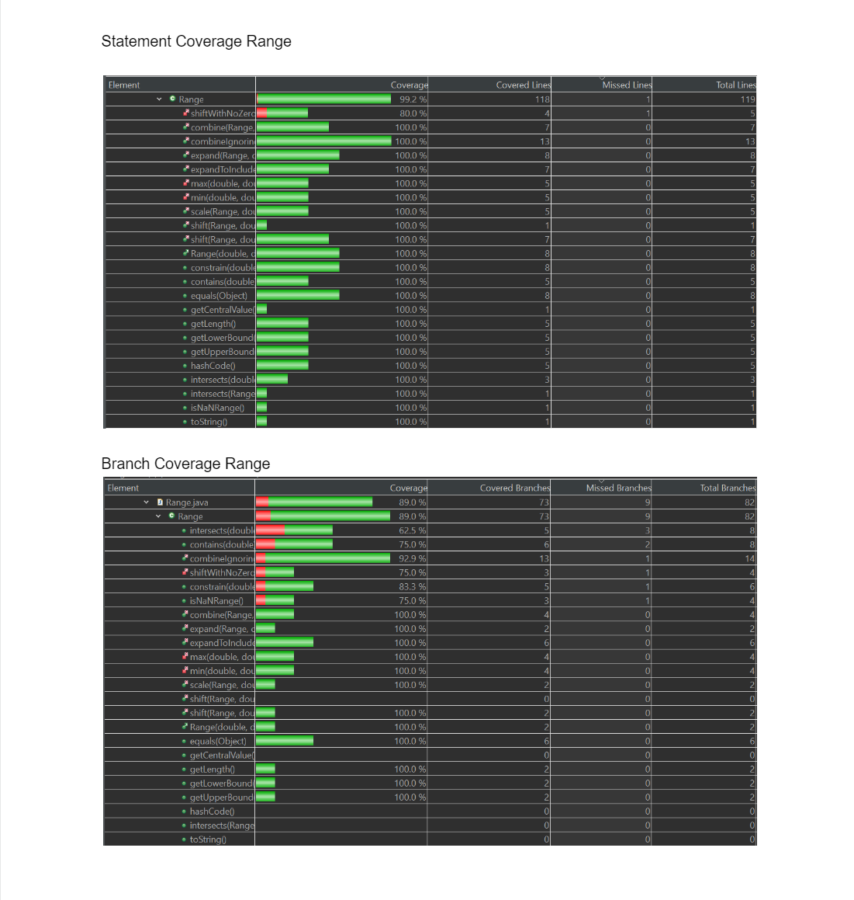
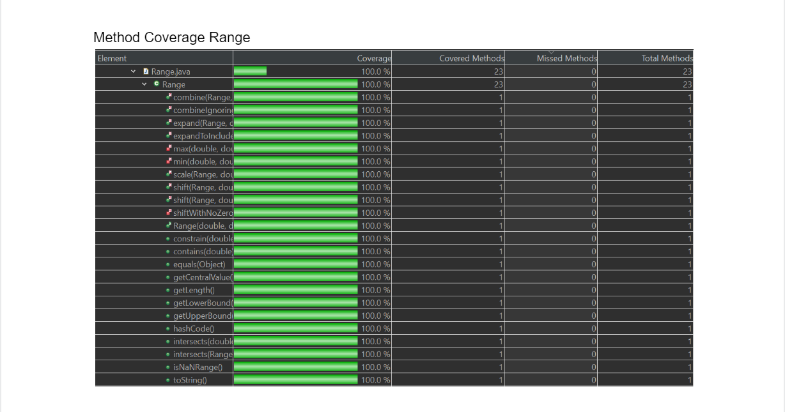

**SENG 438 - Software Testing, Reliability, and Quality**

**Lab. Report #3 – Code Coverage, Adequacy Criteria and Test Case Correlation**

| Group: Group Number   28  |
|-----------------|
| Student 1 name:   Ahmad Janjua        |   
| Student 2 name:   Maxwell Kepler      |   
| Student 3 name:   Christopher Luk     |   
| Student 4 name:   Matthew Ho          | 

(Note that some labs require individual reports while others require one report
for each group. Please see each lab document for details.)

**Table of Contents**

[1 Introduction	](#introduction)

[2 Manual data flow coverage calculations for X and Y methods ](#manual-data-flow-coverage-calculations-for-x-and-y-methods)

[3 A detailed description of the testing strategy for the new unit test](#a-detailed-description-of-the-testing-strategy-for-the-new-unit-test)

[4 A high level description of five selected test cases you have designed using coverage information, and how they have increased code coverage	](#a-high-level-description-of-five-selected-test-cases-you-have-designed-using-coverage-information-and-how-they-have-increased-code-coverage)

[5 A detailed report of the coverage achieved of each class and method (a screen shot from the code cover results in green and red color would suffice)](#a-detailed-report-of-the-coverage-achieved-of-each-class-and-method-a-screen-shot-from-the-code-cover-results-in-green-and-red-color-would-suffice))

[6 Pros and Cons of coverage tools used and Metrics you report	](#pros-and-cons-of-coverage-tools-used-and-metrics-you-report)

[7 A comparison on the advantages and disadvantages of requirements-based test generation and coverage-based test generation.](#a-comparison-on-the-advantages-and-disadvantages-of-requirements-based-test-generation-and-coverage-based-test-generation)

[8 A discussion on how the team work/effort was divided and managed](#a-discussion-on-how-the-team-workeffort-was-divided-and-managed)

[9 Any difficulties encountered, challenges overcome, and lessons learned from performing the lab](#any-difficulties-encountered-challenges-overcome-and-lessons-learned-from-performing-the-lab)

[10 Comments/feedback on the lab itself](#commentsfeedback-on-the-lab-itself)

# Introduction

In this lab, we were tasked with creating and implementing unit tests designed using white-box testing. In doing so, we learned about measuring the adequacy of our previous test suite from Lab 2 by measuring different coverage metrics. To accomplish this, we began by familiarizing ourselves with different testing tools, while trying to analyze our previous test suites on the statement, branch, and condition coverage. After this, we measured out data flow coverage manually by selecting two methods from org.jfree.data, and calculated their DU-pair coverage by tracing through their execution. We proceeded to design new unit tests to test DataUtilities and Range classes, with a goal of achieving a minimum of 90% statement coverage, 70% branch coverage, and 60% condition coverage. During this phase of the lab, we created a test plan and kept each test case in a separate method.

# Manual data-flow coverage calculations for X and Y methods

## Data flow graph
### calculateColumnTotal

### getLength

## DEF-USE sets per statement
### calculateColumnTotal

DEF(1) = {data, column}, q(1) = {data} 
DEF(2) = {total, rowCount, r}, USE(2) = {data, r, rowCount} 
DEF(3) = {n}, USE(3) = {data, r, column, n} 
DEF(4) = {total}, USE(4) = {total, n} 
DEF(5) = Ø, USE(5) = Ø 
DEF(6) = Ø, USE(6) = {r, rowCount} 
DEF(7) = {r2}, USE(7) = {r2, rowCount} 
DEF(8) = {n}, USE(8) = {data, r2, column, n} 
DEF(9) = {total}, USE(9) = {total, n} 
DEF(10) = Ø, USE(10) = Ø 
DEF(11) = Ø, USE(11) = {r2, rowCount} 
DEF(12) = Ø, USE(12) = {total}

### getLength

DEF(1) = {upper, lower}, USE(1) = {upper, lower} 
DEF(2) = {msg}, USE(2) = {upper, lower} 
DEF(3) = Ø, USE(3) = {msg} 
DEF(4) = Ø, USE(4) = {upper, lower}

## All DU-pairs per variable
### calculateColumnTotal

du(1, 1, data) = {[1]} 
du(1, 2, data) = {[1,2]} 
du(1, 3, data) = {[1,2,3]} 
du(1, 8, data) = {[1,2,3,4,6,7,8], [1,2,3,5,6,7,8], [1,2,7,8]} 
du(1, 3, column) = {[1,2,3]} 
du(1, 8, column) = {[1,2,3,4,6,7,8], [1,2,3,5,6,7,8], [1,2,7,8]} 
du(2, 4, total) = {[2,3,4]} 
du(2, 9, total) = {[2,3,4,6,7,8,9], [2,3,5,6,7,8,9], [2,7,8,9]} 
du(2, 12, total) = {[2,3,4,6,7,8,9,11,12], [2,3,5,6,7,8,9,11,12], [2,3,4,6,7,8,10,11,12], [2,3,5,6,7,8,10,11,12], [2,7,8,9,11,12], [2,7,8,10,11,12]} 
du(4, 4, total) = {[4]} 
du(4, 9, total) = {[4,6,7,8,9]} 
du(4, 12, total) = {[4,6,7,8,9,11,12], [4,6,7,8,10,11,12]} 
du(9, 9, total) = {[9]} 
du(9, 12, total) = {[9,11,12]} 
du(2, 2, rowCount) = {[2]} 
du(2, 6, rowCount) = {[2,3,4,6], [2,3,5,6]} 
du(2, 7, rowCount) = {[2,3,4,6,7], [2,3,5,6,7]} 
du(2, 11, rowCount) = {[2,3,4,6,7,8,9,11], [2,3,5,6,7,8,9,11], [2,3,4,6,7,8,10,11], [2,3,5,6,7,8,10,11], [2,7,8,9,11], [2,7,8,10,11]} 
du(2, 2, r) = {[2]} 
du(2, 3, r) = {[2,3]} 
du(2, 6, r) = {[2,3,4,6], [2,3,5,6]} 
du(7, 7, r2) = {[7]} 
du(7, 8, r2) = {[2,8]} 
du(7, 11, r2) = {[7,8,9,11], [7,8,10,11]} 
du(3, 3, n) = {[3]} 
du(3, 4, n) = {[3,4]} 
du(8, 8, n) = {[8]} 
du(8, 9, n) = {[8,9]}

### getLength

du(1, 1, lower) = {[1]} 
du(1, 2, lower) = {[1,2]} 
du(1, 4, lower) = {[1,4]} 
du(1, 1, upper) = {[1]} 
du(1, 2, upper) = {[1,2]} 
du(1, 4, upper) = {[1,4]} 
du(2, 3, msg) = {[2,3]}

## For each test case, show which pairs are covered
### calculateColumnTotal

calculateColumnTotalForTwoValues: du(1, 1, data), du(1, 2, data), du(1, 3, data), du(1, 8, data), du(1, 3, column), du(1, 8, column), du(2, 4, total), du(2, 9, total), du(2, 12, total), du(4, 4, total) du(4, 9, total), du(4, 12, total), du(9, 9, total), du(9, 12, total), du(2, 2, rowCount), du(2, 6, rowCount), du(2, 7, rowCount), du(2, 11, rowCount), du(2, 2, r)du(2, 3, r), du(2, 6, r), du(7, 7, r2), du(7, 8, r2), du(7, 11, r2), du(3, 3, n), du(3, 4, n), du(8, 8, n), du(8, 9, n). 
calculateColumnTotalForNullValues: du(1, 1, data), du(1, 2, data), du(1, 3, data), du(1, 8, data), du(1, 3, column), du(1, 8, column), du(2, 4, total), du(2, 9, total), du(2, 12, total), du(4, 4, total) du(4, 9, total), du(4, 12, total), du(9, 9, total), du(9, 12, total), du(2, 2, rowCount), du(2, 6, rowCount), du(2, 7, rowCount), du(2, 11, rowCount), du(2, 2, r)du(2, 3, r), du(2, 6, r), du(7, 7, r2), du(7, 8, r2), du(7, 11, r2), du(3, 3, n), du(3, 4, n), du(8, 8, n), du(8, 9, n). 
calculateColumnTotalForInvalidIndex: du(1, 1, data), du(1, 2, data), du(1, 3, column), du(2, 2, rowCount), du(2, 2, r) 
calculateColumnTotalForNull: Ø

### getLength

lengthWithTwoDiffNeg: du(1,1,lower), du(1,4,lower), du(1,1,upper), du(1,4,upper) 
lengthWithTwoSameNeg: du(1,1,lower), du(1,4,lower), du(1,1,upper), du(1,4,upper) 
lengthWithZeroAndNeg: du(1,1,lower), du(1,4,lower), du(1,1,upper), du(1,4,upper) 
lengthWithTwoZeros: du(1,1,lower), du(1,4,lower), du(1,1,upper), du(1,4,upper) 
lengthWithZeroAndPos: du(1,1,lower), du(1,4,lower), du(1,1,upper), du(1,4,upper) 
lengthWithTwoSamePos: du(1,1,lower), du(1,4,lower), du(1,1,upper), du(1,4,upper) 
lengthWithTwoDiffPos: du(1,1,lower), du(1,4,lower), du(1,1,upper), du(1,4,upper) 
lengthWithNegAndPos: du(1,1,lower), du(1,4,lower), du(1,1,upper), du(1,4,upper)

## Calculate the DU-Pair coverage
### calculateColumnTotal
calculateColumnTotal:coverage = (29/29)*100%=100%

### getLength
getLength: coverage = 6/7*100%=85.714%

# A detailed description of the testing strategy for the new unit test

First we imported the tests from lab 2. This required importing additional libraries that were missing from lab 3 artifacts zip. Then after importing the previous tests, the coverage tool EclEmma was run. EclEmma then showed the amount of coverage provided to the classes. After having a general understanding of how much coverage was remaining, we split the group up into various tasks. We then split members to focus more on the Range or the DataUtilities class in order to better produce more specific tests for the classes. The strategy for working on each class was to first ensure that all the lines were covered. The test cases were written to support this goal first. Then after writing those, the branch coverage was also focused on if needed. Then after writing the branch tests as well the coverage showed how much method coverage was achieved. With missing method coverage meaning that the program did not call the method and that it was likely unused by the program. EclEmma was used to identify where lines and branch coverage was missing, as well as any missed methods.

# A high level description of five selected test cases you have designed using coverage information, and how they have increased code coverage

combineNormalRange() test case in range checks the method combine with standard inputs. The combine method essentially takes 2 ranges and tries to combine them to return an even larger range that includes the original two ranges. The combineNormalRange test does not do anything special and in fact just inputs two standard ranges and checks if the method has executed the operation correctly. In our assignment 2 we did not test for this method originally. This caused our coverage for this case to be 0% for line coverage, 0% branch coverage, and 0% for method coverage. In assignment 3 we visited this method with many test cases including the test case described above which allowed us to gain a coverage of 100% line coverage, 100% branch coverage, and 100% method coverage.

expandNormal() test case in range checks the method expand with standard inputs. The expand method essentially makes a new range by adding margins to the current range. The expandNormal test case does not do anything special and in fact just inputs a standard range and 2 margin values into the method in question. In our assignment 2 we did not test for this method originally which caused our coverage to be 0% line coverage, 0% branch coverage, and 0% method coverage. In assignment 3 we were able to visit this method with many test cases including the method described above which allowed us to gain a line coverage of 100%, branch coverage of 100%, and a method coverage of 100%.

shiftNormalTrue() test case in range checks the method shift with standard inputs. The shift method essentially shifts the range of the original base range by a particular amount specified in the inputs. The shiftNormalTrue method case from a front perspective does not do anything special but insert just standard inputs and tests if the method returns the correct output; however, it does also increase the coverage beyond the range of just the method itself. It inadvertently checks not only the shift method, but also the overridden shift function as well as the shiftWithZeroCrossing method. All of which were not tested in assignment 2 which caused it to have a 0% line coverage, 0% branch coverage, and 0% method coverage. By testing this one function we were able to increase the line coverage of all the shift method by 100%, all the branch coverages by roughly 85% across all the shift methods, and all the method coverage by 100%.. 

testCalculateRowTotalc2Loop() test case in Data Utilities checks the method calculateRowTotal to see if it handles a null value correctly when inputted into the matrix. calculateRowTotal returns the total of the values in one row of the supplied datatable by taking only the column numbers in the array into account. This method originally was not tested in Assignment 2 and had 0% line coverage, 0% branch coverage, and 0% method coverage. In assignment 3 it had a line coverage of 75%, branch coverage of 62.5%, and a method coverage of 100% and was tested using the test case above and many similar test cases pertaining to the the method that is being tested.

clone_2x2Array() test case in DataUtilities checks the method clone with a 2 by 2 matrix. The clone method gets an input array and returns a clone of that array. Our test simply inputs a 2x2 array into the method and checks whether the method returns the correct output. The clone method was a method that was not tested in our assignment 2 and so it had a line coverage of 0%, a branch coverage of 0%, and a method coverage of 0%. After testing the method with test case such as the one described above we were able to get line coverage to over 100%, branch coverage 100%, and method coverage 100%.

# A detailed report of the coverage achieved of each class and method (a screen shot from the code cover results in green and red color would suffice)

##Data Utilities

##Range Utilities

# Pros and Cons of coverage tools used and Metrics you report

We tried 3 different code coverage tools, but settled on EclEmma. The first tool used was CodeCover. It provided us with statement, branch, term, loop, conditional expression and synchronized coverage. This was excellent for the metrics needed in our test suite. Additionally CodeCover was easy to install and provided tools like report generation, hot path highlighting, cross platform support, and data visualization such as correlation matrices. CodeCover was great however it was old (from 2006) and was last updated in 2011. This brought on compatibility issues with the Eclipse IDE and for that reason it was not selected. The second coverage tool tested was Coverlipse. Coverlipse was fairly barebones compared to CodeCover, but it provided use, statement and branch coverage. Coverlipse was also very old and was last updated in 2009 according to its website. Coverlipse also lacked widespread adoption so it had minimal debugging support on forums. For this reason Coverlipse was also not used. The final tool used was EclEmma. This tool had support for many different testing tools and it was seamless to install. It provided instruction, line, branch, method, complexity, and type coverage support. EclEmma was missing condition coverage, but provided alternative coverage metrics. EclEmma also provided visualization tools for determining metrics. It was also kept up to date as seen on its GitHub repository. Overall, due to its ease of use, support and its metrics we decided to use EclEmma. The three metrics that were chosen to be reported are statement, branch and method coverage. The purpose of statement coverage is to ensure that as many lines of codes are tested as possible. If a line isn’t run it can't be tested. The purpose of branch coverage is to ensure that the lines of code are reachable. Lastly method coverage is to ensure that the available methods are invoked at some point.

# A comparison on the advantages and disadvantages of requirements-based test generation and coverage-based test generation.

Requirement testing and coverage based testing both have their own advantages and disadvantages. In general they both cover different elements of unit testing. Requirement testing checks for the completeness of the requirements being tested. It makes sure that the desired functionality is present within the program. Coverage testing checks if the implemented code is tested in completion for its lines, branches and conditions. It helps make sure that the implementation of the code is covered. The first benefit of requirement testing is that the tests can be planned as soon as the requirements are determined. With coverage testing you have to wait for the code implementation before moving further with writing tests. In addition, requirement testing allows for the tester to not be knowledgeable about the code. In contrast, the coverage testing requires the tester to be very knowledgeable about the implementation details before they can write code. This means that the tester for a coverage test must be more technically aware. Another advantage of requirement testing is the purposefulness of each test. With coverage testing many tests may be redundant and may not provide any meaningful testing. A benefit of coverage testing over requirement based testing is that even portions of the code that were not listed in the requirements are tested. This means the entirety of the implementation is tested. In requirements testing this is not the case. Certain portions of the code can be untested if the requirements do not illustrate their use. The tests are based on requirements and therefore, may leave things out. In general, both the styles of test development should be used to ensure a larger scope of coverage. If both are used, the advantages and disadvantages of both can be compensated for.

# A discussion on how the team work/effort was divided and managed

The success of any project is highly dependent on how well the team works together to achieve a common goal. During this lab experiment, we prioritized effective teamwork and collaboration to ensure that everyone's skills and abilities were utilized to their fullest potential. To manage the workload, we broke down the tasks into various segments and distributed them accordingly. Ahmad took on task 3.1, Max worked on task 3.2, and Matthew and Christopher collaborated on task 3.3 since Max felt most comfortable doing 3.2, and Ahmad volunteered to do 3.1. We made sure to divide the tasks as evenly as possible to ensure that no one was overburdened with work. Communication was also a crucial aspect of our team's effort. We regularly checked in with each other, shared our progress, and offered help or advice when needed. We encouraged an open and collaborative environment where everyone's thoughts and opinions were valued and respected. Moreover, we were willing to adapt and make changes to our approach as needed to ensure that we met our objectives. We were flexible in reassigning tasks or redistributing the workload to accommodate any challenges that arose during the experiment. Overall, our team effort was successful in accomplishing our goals due to effective communication, collaboration, and flexibility. We were able to leverage our individual strengths to complete the lab experiment efficiently and effectively.

# Any difficulties encountered, challenges overcome, and lessons learned from performing the lab

During the lab experiment, we encountered some difficulties related to the compatibility between new libraries and old functions. We realized that we were only using the libraries in the assignment 3 zip folder, which was causing errors while running the tests. However, we soon discovered that we also needed the libraries in the assignment 2 folder for the tests to run without any issues. This challenge taught us the importance of being thorough and attentive to details while working on technical tasks. It also reinforced the significance of reflection and patience in the problem-solving process. Instead of getting frustrated and giving up, we took a step back and analyzed the situation to determine what was missing and how we could solve the issue. Moreover, this experience highlighted the importance of communication and collaboration in a team setting. We worked together and shared our insights to overcome the compatibility challenges and ensure that the lab experiment was completed successfully.

Another challenge that we encountered was when Christopher was creating test cases to have coverage for a conditional loop within DataUtilities and couldn’t figure out how to do it. This was an important test case to add because it improved our test suite's coverage. However, Ahmad gave him a helping hand and helped him figure out how to get the additional 1.5% line coverage. This experience showed us the significance of teamwork and support within a project. It also reinforced the importance of being resourceful and seeking help when needed. Overall, these challenges taught us valuable lessons about the importance of attention to detail, problem-solving, communication, collaboration, and support in technical projects.

# Comments/feedback on the lab itself

We found that the lab was well-structured and provided great hands-on experience in unit testing and code coverage tools. The lab's objectives were clear and focused on teaching us how to determine the adequacy of a white-box test suite based on its coverage of the code. I appreciated the emphasis on completeness, which is important when testing software to ensure it is reliable and error-free. The lab provided an excellent opportunity to learn how to use code coverage tools to measure test adequacy, design test cases, understand the benefits and drawbacks of measuring test adequacy with code coverage tools, and gain an understanding of how data-flow coverage works. Overall, the lab was a valuable learning experience that helped me deepen my understanding of unit testing and code coverage tools, and I would recommend it to other software engineering students.

